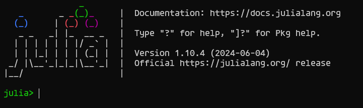
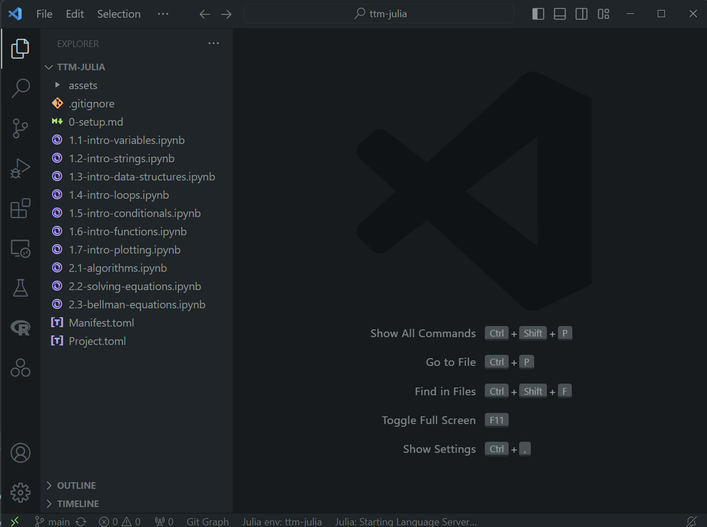

# Guía de instalación de Julia

## Resumen

Primero lo primero. En esta guía se muestran instrucciones para instalar Julia, el lenguaje que vamos a usar en el taller.

Además, se recomiendan otras herramientas que pueden permitirles acceder a mejores formas de trabajar en sus proyectos:

- [Jupyter Notebooks](http://jupyter.org/). Documentos que permiten combinar código, texto, ecuaciones y gráficos. Sirven para Julia, pero también Python y R.
- [Visual Studio Code (VS Code)](https://code.visualstudio.com). El editor de texto de código abierto más utilizado, tiene un amplio conjunto de funciones y extensiones que simplifican el trabajo.
- [Git](https://git-scm.com/). La herramienta de control de versiones de código abierto más utilizada. Permite descargar tanto los archivos como todo el historial de versiones de un proyecto desde un servidor (por ejemplo, en GitHub) a una carpeta local.

## Instalación de Julia y Jupyter

### Instalar Jupyter

[Anaconda](https://www.anaconda.com/) permite instalar de forma sencilla Jupyter, Python y muchas otras herramientas de análisis de datos.

Descargar el instalador (https://www.anaconda.com/download/) y seguir las instrucciones para instalar en el sistema operativo que corresponda.

### Instalar Julia

1. Descargar e instalar Julia siguiendo las instrucciones de [Juliaup](https://github.com/JuliaLang/juliaup#installation)
    - Windows: Desde una terminal, correr `winget install julia -s msstore`
    - Linux/Mac: Desde una terminal, correr `curl -fsSL https://install.julialang.org | sh`
    - Alternativamente, descargar el instalador y seguir instrucciones: http://julialang.org/downloads/

2. Abrir Julia
    - Desde el menú de Windows
    - Desde la terminal, corriendo `julia`
   
        Debería aparecer algo así: 
    

        Esto es el REPL de Julia (Read-Evaluate-Print-Loop). En la práctica, es muy similar a tener R o Stata abiertos y correr código de forma interactiva (esto no es usual en otros lenguajes de programación).

3. En el REPL de Julia, apretar `]` para entrar en el modo de paquetes y escribir `add IJulia`.
    - Esto agrega los paquetes necesarios para que conectar Julia y Jupyter.

4. Salir del REPL de Julia borrando (para salir del modo de paquetes) y escribir `exit()`.

## Instalación y configuración de Git y VS Code

1. Instalar [Git](https://git-scm.com/book/en/v2/Getting-Started-Installing-Git/) y aceptar las opciones por defecto
2. Instalar [VS Code](https://code.visualstudio.com/)
3. Instalar la extensión de [Julia para VS Code](https://marketplace.visualstudio.com/items?itemName=julialang.language-julia)
    - Después de instalar VS Code se debería poder hacer click en `Install` en cualquier extensión del marketplace de extensiones en `visualstudio.com`.
    - Otra forma de instalar desde VS Code: usar `<Ctrl+Shift+X>` para abrir el panel de extensiones y buscar Julia en el marketplace.

## Descargar material del curso

Con todo lo anterior solucionado, pasamos a descargar los materiales del taller.

Desde VS Code se puede clonar fácilmente el repositorio con las notebooks:

1. Abrir la Paleta de Comandos con `<Ctrl+Shift+P>` y escribir `> Git: Clone`.
2. La URL del repositorio es: `https://github.com/chezlag/ttm-julia`
3. Elegir donde guardar el repositorio clonado
4. Aceptar la opción de abrir en una nueva ventana

El repositorio en VS Code debería lucir así:

## Instalar paquetes

Procedemos a instalar los paquetes que necesitamos para correr el taller. 

Para ello, usamos la terminal integrada en el VS Code.

1. Abrimos el REPL de Julia. 
    - Desde la paleta de comandos `<Ctrl+Shift+P>` corremos `> Julia: Start REPL`.
2. Apretar `]` para entrar en el modo de paquetes. Debería indicar que el proyecto está activo cambiando el cursor a `(ttm-julia) pkg>`
3. Correr `instantiate` para instalar todos los paquetes necesarios para el taller.

El proceso va a llevar varios minutos. Una vez terminen, van a tener todo lo necesario para resolver el taller.

> ❗ **Atención**
>
> Si el cursor dice `(@v1.10) pkg>` entonces puede que la terminal no se haya iniciado en la ubicación correcta. Asumiendo que se encuentra en la carpeta correcta, escribir `activate .` en el modo paquete debería activar el proyecto, y el cursor debería cambiar a `(ttm-julia) pkg>`.
